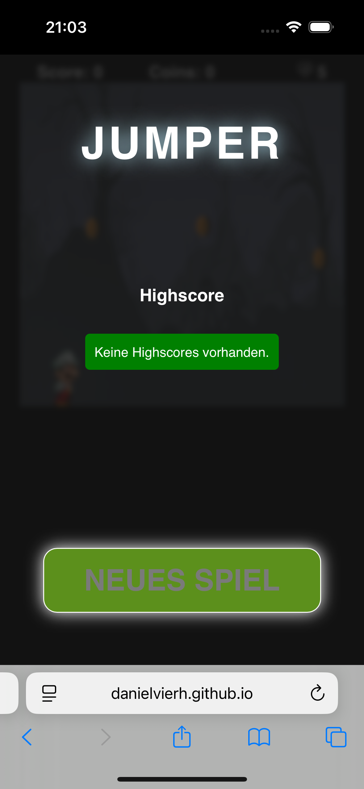
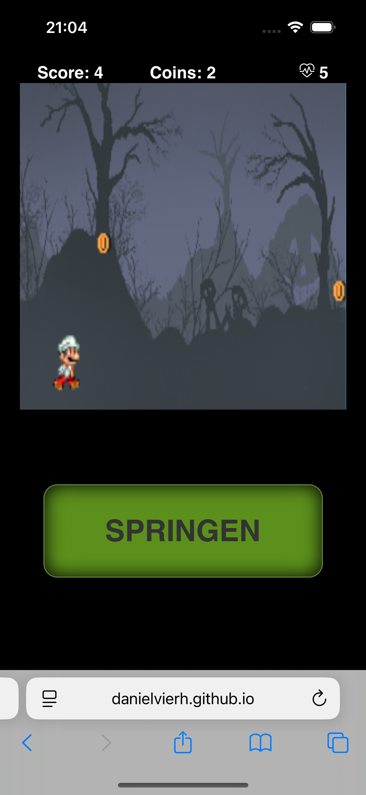
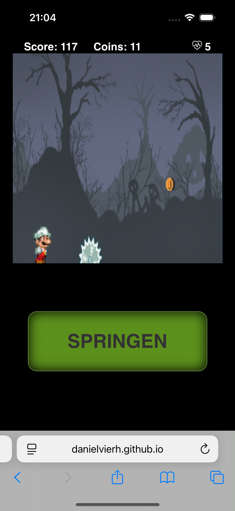

# Jumper – Browser Jump'n'Run

Ein schnelles 2D-Jump’n’Run im Browser: ausweichen, springen, Münzen sammeln und so lange wie möglich überleben.

## Auf einen Blick

- **Genre:** Endless Jump'n'Run
- **Ziel:** Höchstmögliche Punktzahl erreichen
- **Plattform:** Browser (Desktop)
- **Spielgefühl:** Reaktionsschnell, arcade-lastig, kurze und motivierende Runden

## Spielregeln

1. Du steuerst den Charakter durch eine kontinuierlich laufende Spielwelt.
2. **Gegner** und **Hindernisse** müssen übersprungen oder umgangen werden.
3. **Münzen** erhöhen deinen Score.
4. Bei Kollisionen verlierst du (oder wirst deutlich zurückgeworfen – je nach Spielsituation).
5. Ziel ist es, den eigenen **Highscore** zu knacken.

## Steuerung

- **Leertaste / Pfeil hoch**: Springen
- **Weitere Tasten** (falls aktiviert): je nach Spielzustand für Neustart/Interaktion

> Hinweis: Die konkrete Tastenbelegung kann je nach Implementierungsstand in `src/js/script.js` variieren.

## Eindruck der Anwendung

- Klarer, direkter Spielablauf ohne lange Einarbeitung
- Visuelles Feedback durch Gegner, Objekte und Sammel-Items
- Fokus auf „noch eine Runde“-Motivation durch Score- und Highscore-System

## Screenshots

---

Viel Spaß beim Springen und Highscore-Jagen! 🚀
